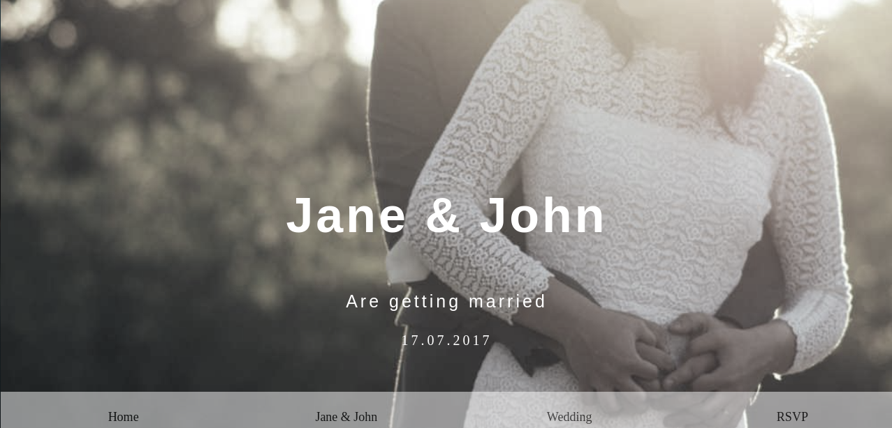

# wedding-invitation project
This project is all about a wedding template which takes into account and shows as follows: The first part or section gives a view of john holding jane, second image shows them embracing and the 3rd and
last image denotes the invitation and venue. lastly, the footer and link.
## App
 
### Built with
- HTML
- CSS
### Prerequisites
knowledge about:
- HTML
- CSS
- Google Chrome
### Clone project
- Get a local copy of the project by following these steps.
- clone the repository with`git@github.com:NSUTEBU/wedding-invitation.git`using your terminal
## Steps
-$ `git@github.com:NSUTEBU/wedding-invitation.git`using your terminal
-$ `cd wedding-invitation`
-$ `git checkout feature/content`
## Start App
- run by opening the index.html in the browser
## Author
:bust_in_ silhouette: **Nsutebu**
- Github: [@Nsutebu](https://github.com/NSUTEBU/wedding-invitation)
## :handshake: contributing
contributions, issues, and feature requests are welcome!
feel free to check the [issues page](https://github.com/NSUTEBU/wedding-invitation/issues).
## :memo: license
This project is [w3school](./LICENSE) licensed.
